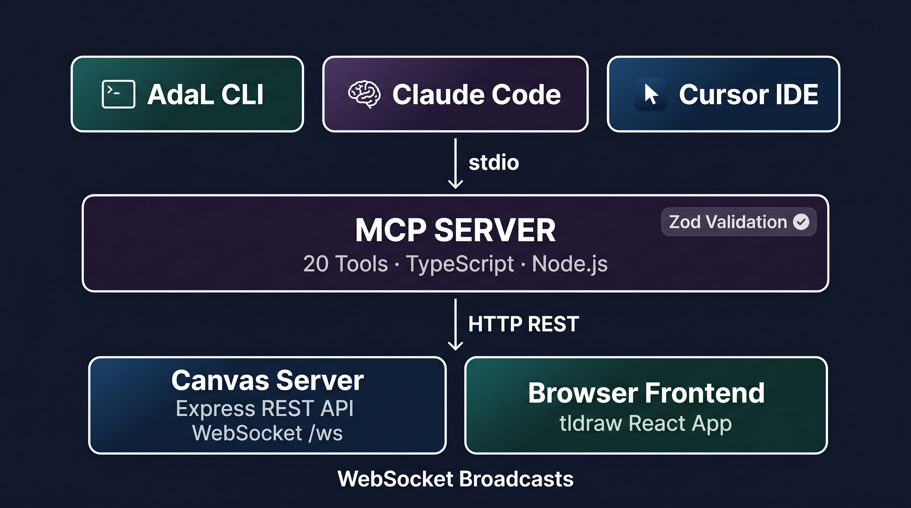

<p align="center">
  
</p>

# tldraw MCP Server

> Programmatic canvas toolkit for AI agents — create, read, update, and delete tldraw shapes in real time via the Model Context Protocol.

[](https://github.com/Mihai-Codes/tldraw-mcp-server/actions/workflows/ci.yml)
[](https://nodejs.org/)
[](https://www.typescriptlang.org/)
[](https://react.dev/)
[](https://tldraw.dev/)
[](https://modelcontextprotocol.io/)
[](https://opensource.org/licenses/MIT)

## What It Is

An MCP server that gives AI agents (AdaL, Claude, Cursor, Codex CLI…) programmatic control over a live tldraw canvas. Draw diagrams, architecture charts, and flowcharts by just describing what you want.

**Inspired by** [mcp_excalidraw](https://github.com/yctimlin/mcp_excalidraw) — the same quality and completeness, built for the tldraw ecosystem.

## Architecture



**Flow:** MCP client → MCP server (Zod validation) → Canvas server (Express HTTP) → WebSocket broadcast → Browser (tldraw editor, real time).

---

## Quick Start

### Prerequisites

- Node.js >= 18

### 1 — Install & Build

```bash
git clone https://github.com/chindris-mihai-alexandru/tldraw-mcp-server.git
cd tldraw-mcp-server
npm install
npm run build
npm run build:frontend
```

### 2 — Start the Canvas Server

```bash
npm run canvas
# Canvas running at http://127.0.0.1:3000
```

Open **http://127.0.0.1:3000** in your browser — this is the live canvas.

### 3 — Connect an MCP Client

The `.mcp.json` at the repo root works out-of-the-box for any project-level MCP client:

```json
{
  "mcpServers": {
    "tldraw": {
      "command": "node",
      "args": ["dist/index.js"],
      "env": {
        "EXPRESS_SERVER_URL": "http://127.0.0.1:3000"
      }
    }
  }
}
```

---

## MCP Client Configuration

The default transport is **stdio**, so existing configs continue to work. Set `MCP_TRANSPORT=http` for shared HTTP endpoints (OpenAI Agents SDK, etc.).

### Transport and adapter options

| Variable | Default | Purpose |
|----------|---------|---------|
| `MCP_TRANSPORT` | `stdio` | `stdio` for subprocess clients, `http` for Streamable HTTP |
| `MCP_CLIENT` | `generic` | Client hint: `adal`, `claude`, `cursor`, `openai`, `generic` |
| `MCP_SERVER_NAME` | `tldraw` | Server name for optional tool prefixes |
| `INCLUDE_SERVER_IN_TOOL_NAMES` | `false` | Expose tools as `tldraw__create_element` |
| `MCP_PERFORMANCE_MODE` | `false` | Compact tool descriptions to reduce discovery context |
| `MCP_HTTP_HOST` | `127.0.0.1` | HTTP bind host |
| `MCP_HTTP_PORT` | `3333` | HTTP bind port |
| `MCP_HTTP_PATH` | `/mcp` | Streamable HTTP MCP path |
| `MCP_ALLOWED_ORIGINS` | local origins | Comma-separated Origin allowlist |
| `MCP_ALLOWED_HOSTS` | local hosts | Comma-separated Host allowlist |
| `MCP_AUTH_TOKEN` | unset | Bearer-token auth for HTTP (set and send `Authorization: Bearer <token>`) |

### AdaL CLI

Project-level — the `.mcp.json` in this repo is pre-configured. Open AdaL in this directory and the server is auto-discovered.

```bash
cd tldraw-mcp-server
adal
```

Performance mode for lower discovery overhead:

```json
{
  "mcpServers": {
    "tldraw": {
      "command": "node",
      "args": ["dist/index.js"],
      "env": {
        "EXPRESS_SERVER_URL": "http://127.0.0.1:3000",
        "MCP_TRANSPORT": "stdio",
        "MCP_CLIENT": "adal",
        "MCP_PERFORMANCE_MODE": "true"
      }
    }
  }
}
```

### Claude Code

```bash
# Project-level
claude mcp add tldraw --scope project \
  -e EXPRESS_SERVER_URL=http://127.0.0.1:3000 \
  -e MCP_TRANSPORT=stdio \
  -e MCP_CLIENT=claude \
  -- node /absolute/path/to/tldraw-mcp-server/dist/index.js

# User-level (available across all projects)
claude mcp add tldraw --scope user \
  -e EXPRESS_SERVER_URL=http://127.0.0.1:3000 \
  -e MCP_TRANSPORT=stdio \
  -e MCP_CLIENT=claude \
  -- node /absolute/path/to/tldraw-mcp-server/dist/index.js
```

### Claude Desktop

Config: `~/Library/Application Support/Claude/claude_desktop_config.json` (macOS)

```json
{
  "mcpServers": {
    "tldraw": {
      "command": "node",
      "args": ["/absolute/path/to/tldraw-mcp-server/dist/index.js"],
      "env": {
        "EXPRESS_SERVER_URL": "http://127.0.0.1:3000",
        "MCP_TRANSPORT": "stdio",
        "MCP_CLIENT": "claude"
      }
    }
  }
}
```

### Cursor

Config: `.cursor/mcp.json` (project) or `~/.cursor/mcp.json` (global)

```json
{
  "mcpServers": {
    "tldraw": {
      "command": "node",
      "args": ["/absolute/path/to/tldraw-mcp-server/dist/index.js"],
      "env": {
        "EXPRESS_SERVER_URL": "http://127.0.0.1:3000",
        "MCP_TRANSPORT": "stdio",
        "MCP_CLIENT": "cursor"
      }
    }
  }
}
```

If a gateway expects server-prefixed tool names (`tldraw__create_element`), add `"INCLUDE_SERVER_IN_TOOL_NAMES": "true"` to the env.

### OpenAI Agents SDK

Use Streamable HTTP for OpenAI Agents SDK and other shared-agent environments:

```bash
MCP_TRANSPORT=http \
MCP_HTTP_HOST=127.0.0.1 \
MCP_HTTP_PORT=3333 \
MCP_HTTP_PATH=/mcp \
EXPRESS_SERVER_URL=http://127.0.0.1:3000 \
MCP_CLIENT=openai \
node dist/index.js
```

```ts
import { Agent } from '@openai/agents'

const agent = new Agent({
  name: 'diagram-agent',
  instructions: 'Use the tldraw MCP server to create and inspect diagrams.',
  mcpServers: [
    {
      name: 'tldraw',
      url: 'http://127.0.0.1:3333/mcp',
      headers: process.env.MCP_AUTH_TOKEN
        ? { Authorization: `Bearer ${process.env.MCP_AUTH_TOKEN}` }
        : undefined,
    },
  ],
})
```

### Codex CLI

```bash
codex mcp add tldraw \
  --env EXPRESS_SERVER_URL=http://127.0.0.1:3000 \
  --env MCP_TRANSPORT=stdio \
  -- node /absolute/path/to/tldraw-mcp-server/dist/index.js
```

### Supergateway / systemd

Wrap the stdio server with `supergateway` for an HTTP endpoint:

```bash
npx -y supergateway \
  --stdio "node /opt/tldraw-mcp-server/dist/index.js" \
  --port 3333 \
  --baseUrl http://127.0.0.1:3333 \
  --ssePath /mcp \
  --messagePath /messages
```

Example `systemd` unit:

```ini
[Unit]
Description=tldraw MCP HTTP Gateway
After=network.target

[Service]
Type=simple
WorkingDirectory=/opt/tldraw-mcp-server
Environment=EXPRESS_SERVER_URL=http://127.0.0.1:3000
Environment=MCP_PERFORMANCE_MODE=true
ExecStart=/usr/bin/npx -y supergateway --stdio "node dist/index.js" --port 3333 --baseUrl http://127.0.0.1:3333 --ssePath /mcp --messagePath /messages
Restart=always
RestartSec=5

[Install]
WantedBy=multi-user.target
```

### Migration and rollback

No migration is required for existing AdaL users — stdio remains the default. To roll back optional behavior, unset `MCP_TRANSPORT`, `MCP_PERFORMANCE_MODE`, and `INCLUDE_SERVER_IN_TOOL_NAMES`, then use the original `.mcp.json` shape with only `EXPRESS_SERVER_URL`.

---

## MCP Tools (27 tools)

### Canvas Operations

| Tool | Description |
|------|-------------|
| `create_element` | Create a shape, text, arrow, or note on the canvas |
| `get_element` | Get a single element by ID |
| `update_element` | Partially update any element property |
| `delete_element` | Delete an element by ID |
| `query_elements` | List/filter elements by type and bounding box |
| `batch_create_elements` | Create multiple elements atomically |
| `clear_canvas` | Remove all elements (requires `confirm: true`) |

### Grouping

| Tool | Description |
|------|-------------|
| `group_elements` | Group 2+ elements — they move and transform as a unit |
| `ungroup_elements` | Dissolve a group, releasing all children as independent shapes |

### Sticky Notes

| Tool | Description |
|------|-------------|
| `create_sticky` | Create a sticky note with sensible defaults (yellow, solid fill) |
| `update_sticky` | Update the content or styling of an existing sticky note |
| `list_sticky_templates` | Return pre-built sticky templates with recommended colors and use cases |

### Layout & Alignment

| Tool | Description |
|------|-------------|
| `align_elements` | Align multiple elements left/center/right/top/middle/bottom |
| `distribute_elements` | Distribute elements evenly along horizontal or vertical axis |
| `auto_layout` | Automatically arrange using dagre, force-directed, or grid layout |

### Viewport & Scene

| Tool | Description |
|------|-------------|
| `set_viewport` | Zoom, pan, zoom-to-fit, or center on a specific element |
| `read_diagram_guide` | Return color names, presets, and layout best practices |
| `describe_scene` | Summarize all canvas elements, positions, labels, and connections |
| `export_scene` | Export all elements as a JSON snapshot |
| `import_scene` | Import a JSON scene in replace or merge mode |
| `snapshot_scene` | Save the current canvas as a named in-memory snapshot |
| `restore_snapshot` | Restore a previously saved named snapshot |

### Export

| Tool | Description |
|------|-------------|
| `get_canvas_screenshot` | Capture PNG from the canvas (server-side via Playwright, no browser needed) |
| `export_svg` | Export canvas as an SVG string |
| `export_png` | Export canvas as a PNG image (server-side Playwright) |
| `export_jpg` | Export canvas as a JPEG image (server-side Playwright) |
| `export_pdf` | Export canvas as a PDF (Playwright for full fidelity, pdf-lib fallback) |

---

## Shape Types

`rectangle` · `ellipse` · `diamond` · `triangle` · `text` · `arrow` · `line` · `note` · `frame` · `star` · `cloud` · `hexagon`

## Element Properties

| Property | Values | Default |
|----------|--------|---------|
| `color` | `black` · `grey` · `blue` · `light-blue` · `violet` · `light-violet` · `red` · `light-red` · `orange` · `yellow` · `green` · `light-green` · `white` | `black` |
| `fill` | `none` · `semi` · `solid` · `pattern` | `none` |
| `dash` | `draw` · `solid` · `dashed` · `dotted` | `draw` |
| `size` | `s` · `m` · `l` · `xl` | `m` |
| `font` | `draw` · `sans` · `serif` · `mono` | `draw` |

---

## Development

```bash
# Type check
npm run type-check

# Backend (watch mode)
npm run dev:canvas   # canvas server on :3000
npm run dev          # MCP server on stdio

# Frontend (watch mode with hot reload)
npm run dev:frontend # Vite dev server on :5173

# Build everything
npm run build:all

# Run the full test suite once
npm test -- --run
```

### Testing a Tool

```bash
# Create a rectangle
npx @modelcontextprotocol/inspector --cli \
  -e EXPRESS_SERVER_URL=http://127.0.0.1:3000 \
  -- node dist/index.js --method tools/call \
  --tool-name create_element \
  --tool-arg type=rectangle --tool-arg x=100 --tool-arg y=100 \
  --tool-arg width=200 --tool-arg height=80 \
  --tool-arg text="Hello" --tool-arg color=blue --tool-arg fill=semi

# List all tools
npx @modelcontextprotocol/inspector --cli \
  -e EXPRESS_SERVER_URL=http://127.0.0.1:3000 \
  -- node dist/index.js --method tools/list
```

---

## Troubleshooting

### Screenshot tool fails with "empty data"

`get_canvas_screenshot` prefers a server-side render (SVG + Playwright, no browser required). If Playwright is not installed or the export fails for any reason, it falls back to browser-based rendering. To ensure screenshots always work:

```bash
# Install Playwright (one-time)
npm install playwright
npx playwright install chromium
```

If the error persists even with Playwright installed, ensure the canvas server is running (`npm run canvas`) and try again.

---

## License

[MIT](LICENSE)

## Acknowledgments

- [tldraw](https://tldraw.dev/) — The infinite canvas SDK
- [mcp_excalidraw](https://github.com/yctimlin/mcp_excalidraw) — Reference architecture
- [Model Context Protocol](https://modelcontextprotocol.io/) — Open standard for AI tool integration
